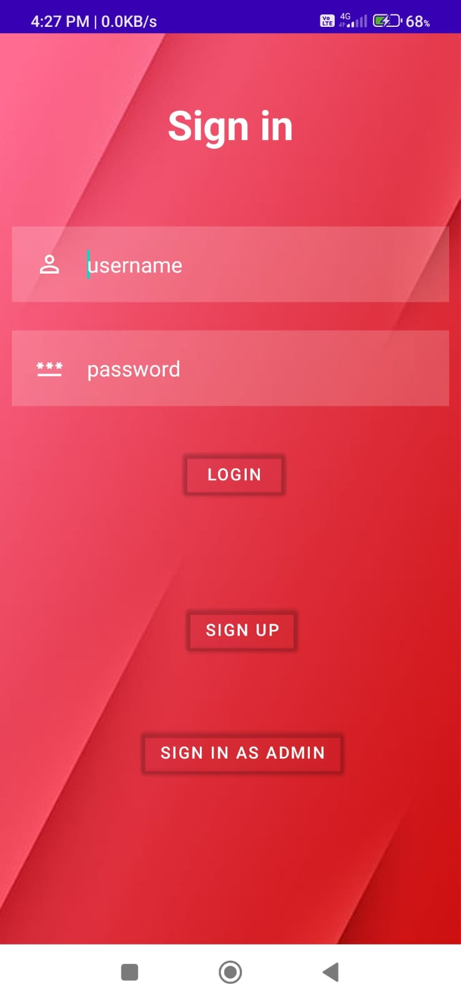
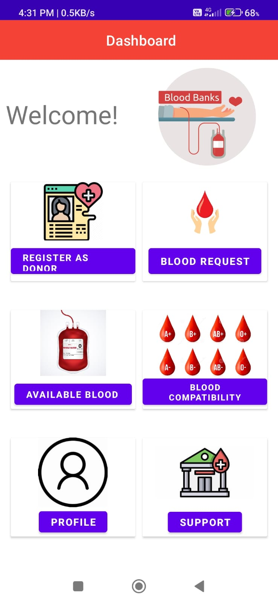
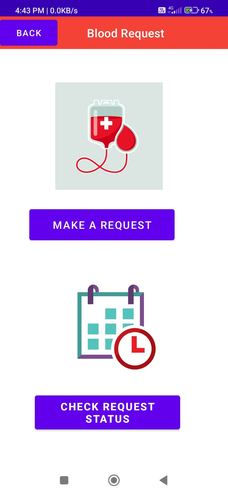
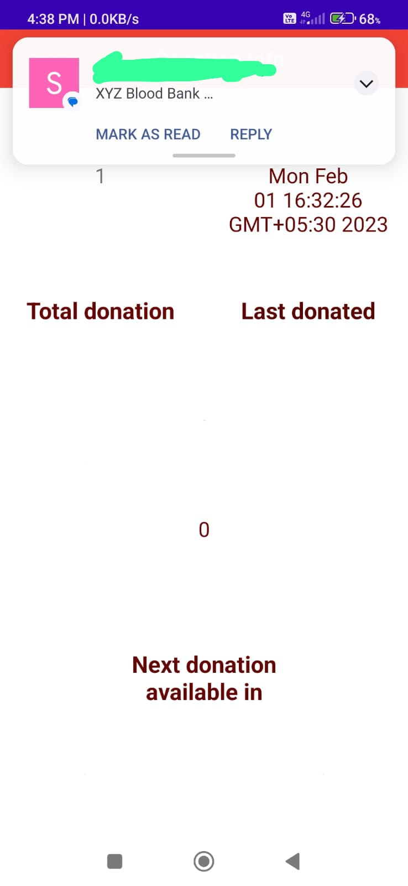
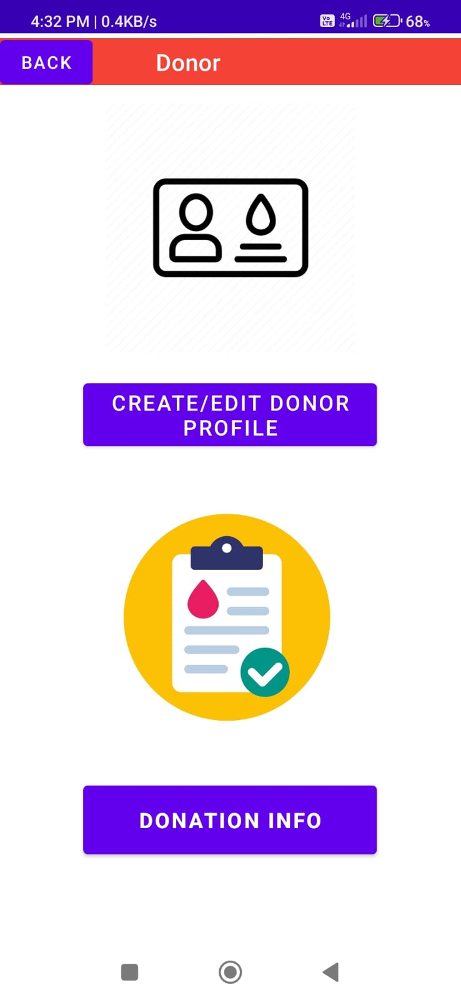
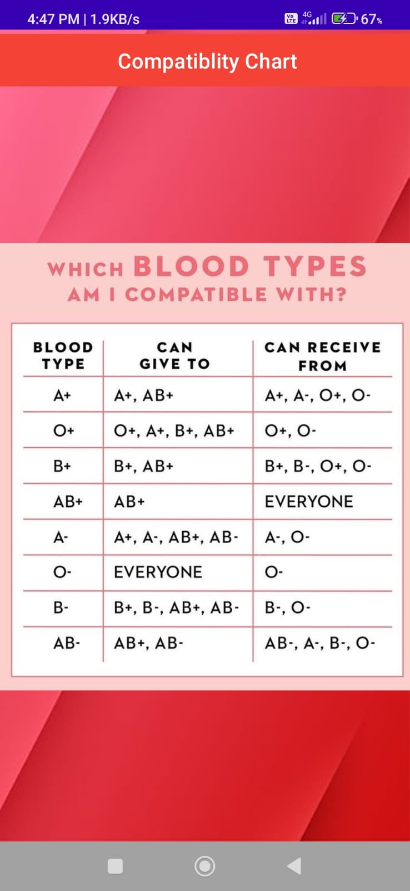
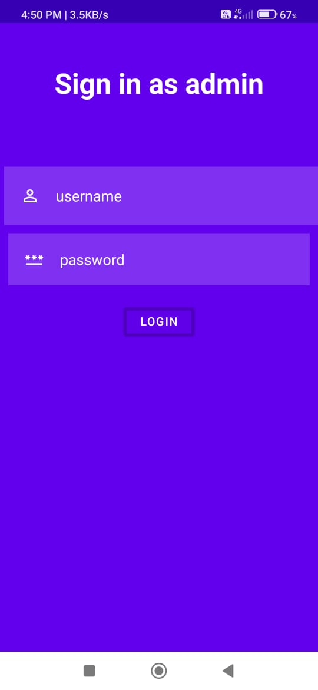
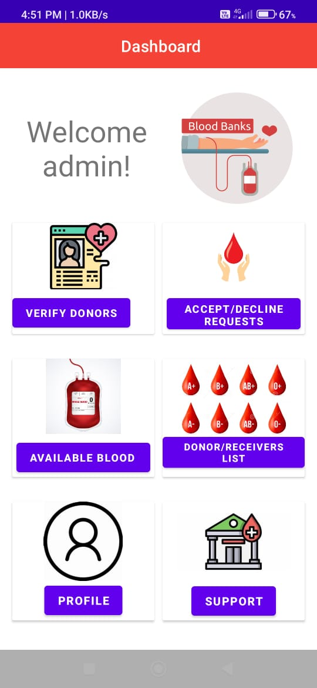
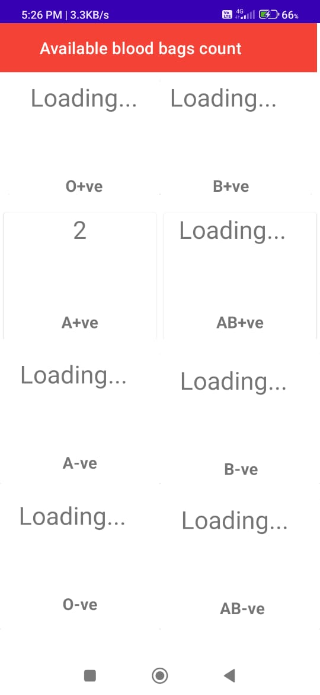
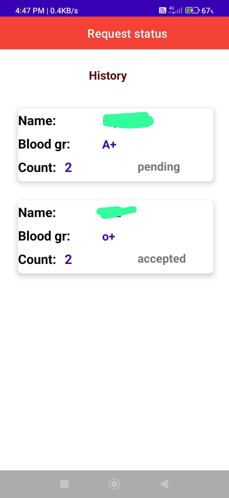

# Blood Bank Management System using Android App

A comprehensive Blood Bank Management System integrated with Android App helps to efficiently manage blood inventory, donor information, and facilitate seamless communication between donors and recipients.

## User Functionality.

<a href="screenshots/Donation_history.jpeg">
<a href="screenshots/Donor_create_update.jpeg">
<a href="screenshots/Compatiblity_chart.jpeg">

## Admin Functionality

## Features

- **Real-time Inventory Management:** Utilizes a custom tray with NodeMCU, load cells, and HX711 for accurate blood bag counting by weight, ensuring real-time inventory tracking.

- **User Authentication:** Securely integrated with Firebase for user authentication, providing a reliable and safe environment for donors and recipients.

- **Messaging System:** Implements a messaging feature to notify donors to donate after 90 days. Admins receive alerts when blood bag count falls below 2, enabling timely communication.

- **User Interaction:** Empowers donors to review and update their information. Users can request a specific amount of blood bags, and Blood Bank admins can efficiently accept or reject requests based on predefined conditions.

## Technologies Used

- **Android Studio:** Crafted the Android app using the versatile Android Studio.
  
- **Java & XML:** Utilized Java for backend functionality and XML for UI design, ensuring a seamless and intuitive user interface.

- **Firebase:** Leveraged Firebase for secure user authentication and efficient data management.

- **Arduino IDE:** Employed Arduino IDE for the custom tray's development, integrating hardware seamlessly into the app's functionality.

## Getting Started

To run this project 
git clone https://github.com/2212rutuja/BloodBankAndroidApp.git

## Usage
- The administration of blood banks includes maintaining records of the blood that is available as well as data about donors and patients who require blood.
- A mobile-based application helps to reduce issues with data redundancy and human error.
- Since the information entered will be regularly updated and validated, it is a quick and effective way to communicate without posing any risks. This increases the likelihood that someone will be saved from harm.
- According to the results, using the online blood bank management system over the manual method provides several advantages and benefits that increase its efficacy and efficiency.

## Contributing
Contributions ane welcomed! If you'd like to contribute, please follow our contribution guidelines.

